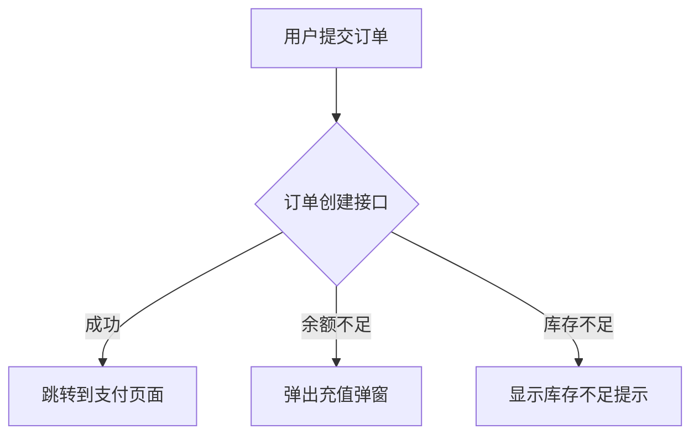
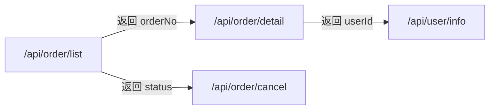

# 接口溯源 (API Locator)

从后端接口/字段出发，反向追溯其在前端项目中的使用全貌——在哪些页面被调用、什么时机触发、入参从哪来、出参怎么展示、接口之间有什么关联。

## 两种模式

根据**任务复杂度**自动判断走哪种模式，而非仅凭句式。

### 复杂度判断规则

先做一次快速扫描（搜索接口路径在项目中的出现次数），根据结果决定：

| 条件                               | 模式     |
| ---------------------------------- | -------- |
| 单个接口，调用点 <= 3 处，逻辑简单 | Q&A 模式 |
| 单个接口，调用点 > 3 处            | 报告模式 |
| 多个接口，或按微服务范围           | 报告模式 |
| 涉及跨接口关联、复杂条件判断       | 报告模式 |
| 用户明确要求梳理/分析/报告         | 报告模式 |
| 用户简短提问，且实际调用点 <= 3 处 | Q&A 模式 |

核心原则：**简单任务不给文件，直接回答；复杂任务生成报告，避免刷屏。**

### Q&A 模式（即时问答）

直接搜索代码、分析、给出答案。不生成文件。

**支持多轮对话**：记住会话中讨论过的接口，后续问题中用户用代词指代时自动关联上一轮的接口，复用已搜索的结果。

### 报告模式（生成报告）

生成一份 Markdown 报告文件，保存后给出摘要。用户可在文件中查看完整分析。

---

## Q&A 模式

### 工作流程

1. **解析问题**：提取目标接口名/字段名、问题类型（定位/入参/出参/对比/字段溯源）
2. **全局搜索**：在项目中搜索接口路径或字段名，定位所有调用点
3. **追溯链路**：从每个调用点一路 `import` 追溯到页面入口
4. **分析上下文**：读取相关代码，分析触发时机、入参来源、出参消费
5. **跨接口关联**：检查该接口的返回字段是否被其他接口用作入参，反之亦然
6. **组织草稿**：按下面模板整理初步结果
7. **验证结果**：提交草稿给验证 sub-agent 做代码复核（验证流程见下方「结果验证」章节），修正发现的问题
8. **输出最终答案**

### 搜索策略

- **接口路径搜索**：直接搜索完整路径（如 `trade-service/api/order/list`）或路径片段
- **字段名搜索**：搜索 `res.data.xxx`、`response.xxx`、`.then(res => res.xxx)` 等模式
- **HTTP 调用模式**：搜索 `axios.get/post`、`request(`、`fetch(`、`$http`、`api.xxx` 等
- **追溯链路**：从调用文件开始，沿 `import` 语句反向追溯，直到找到页面入口组件（路由配置中引用的组件）。跳过 `node_modules` 中的第三方包。

  **组件渲染条件分析**：当接口调用位于子组件中时，必须检查该子组件的渲染条件。子组件可能被 v-if 控制渲染、存在于弹窗/抽屉/标签页中、或被多层嵌套。逐层向上检查每个父组件中引入该子组件时的条件，直到页面入口，最终合并为完整的触发条件描述。例如不是简单说"页面加载时调用"，而是"用户点击表格行后弹出详情抽屉，抽屉中的子组件加载时调用"

- **页面入口判断**：Vue 项目中 `src/views/` 或路由 `component` 字段指向的文件；React 项目中路由 `<Route>` 或 `pages/` 目录下的文件
- **项目级公共函数**：如果调用封装在 `@/api/xxx.ts` 等公共模块中，追溯到该模块但不展开其内部实现，只记录实际请求路径

### 并行搜索

问题涉及多个接口或多个页面时，使用 sub-agent 并行搜索：

- 报告模式下，按接口拆分：每个接口一个 sub-agent 独立搜索调用点和追溯链路
- Q&A 模式下，如果问题涉及跨接口对比，按接口拆分并行搜索
- 主 agent 负责合并结果、去重、组织输出

### 回答模板

```markdown
## {微服务名} {接口路径} 使用情况

### 调用概览

共在 N 个页面/场景中使用。

### 使用详情

#### 1. {页面/场景名称}

- **触发时机**：{从用户操作视角描述，如"用户进入订单列表页时自动加载"、"点击某行的查看详情按钮后触发"}
- **入参来源**：
  - pageNum：固定值 1，翻页时更新
  - status：顶部状态下拉框，用户手动选择（可选值：待支付/已支付/已取消）
- **出参消费**：
  - data.list：表格数据行，无数据时显示"暂无数据"
  - data.total：分页组件显示总条数，不下发时隐藏

#### 2. {下一个页面}

...

### 跨接口关联

- {字段A} 被 {接口B} 作为入参使用，传递场景为...
- {接口C} 的返回字段 {字段D} 被本接口作为入参使用
```

### 回答规范

**核心铁律：如果后端/测试看完一句话后问"这是什么意思？"，这句话就是不合格的。**

输出中绝对不允许出现以下任何内容：

- ❌ 文件名/路径（`io.js`、`mixins.js`、`src/views/xxx.vue`）
- ❌ 函数名/变量名（`getServiceFee`、`props`、`waybillType`、`tonOpen`）
- ❌ 前端框架概念（mixin、组件、展开运算符、watch、mounted、dispatch）
- ❌ 代码片段（任何编程语言代码块）
- ❌ 技术实现描述（"通过展开运算符混入到 query 参数中"）
- ❌ 代码条件表达式（`unit !== '1'`、`type === 3`）——应翻译为业务条件

**反面案例（以下输出不合格）：**

> `getServiceFee` 函数（在 `AddFreight/io.js` 和 `EditFreight/io.js` 中定义）接受第三个参数 `props`，通过展开运算符 `...props` 混入到 query 参数中。`orderType` 就是通过这个渠道传进去的。
>
> ```js
> if (this.form.waybillType === "2") {
>   params.orderType = 2;
> }
> ```

问题：函数名、文件名、代码片段、技术术语——后端和测试完全看不懂。

**正确写法（同样的信息，用业务语言表达）：**

> - **orderType**：仅在新建订单页的**费用信息**模块中传入。用户在调度信息区选择运单方式后，填写运费时自动触发服务费计算，此时传入 orderType。
>   - 运单方式选择"A场景时"时，传 orderType = 1
>   - 运单方式选择"B场景时"时，传 orderType = 2
>   - 选择"X选项"或"Y选项"时不传该参数
>   - AA页面、BB页面、CC页面的费用模块中调用该接口时均不传 orderType

**必须做到**：

- ✅ 翻译成业务语言：不是"组件 mounted 时调用"，而是"用户进入页面时自动加载"
- ✅ 大白话风格：像给同事口头解释一样叙述
- ✅ 按用户体验生命周期排序：页面加载 → 用户操作 → 结果反馈
- ✅ 当代码中找不到明确的业务名称时，结合项目行业和上下文意译一个合理的名称
- ✅ **不用表格**：Q&A 模式的回答将直接被复制到钉钉/微信等 IM 工具中，表格无法正常显示。入参来源、出参消费等结构化信息一律用列表格式（`- 字段名：说明`），不用 markdown 表格
- ✅ **不用代码块**：绝对不要在输出中贴代码，即使你觉得能帮助理解。后端和测试不懂前端代码

**复杂逻辑用 Mermaid 辅助**：
当触发条件涉及多层判断时（如"接口 A 返回错误码后调用接口 B，成功则跳转页面 C"），用流程图：



### 无结果时的处理

搜索不到结果时：

1. 明确告知"在项目中未找到该接口的调用"
2. 列出项目中路径相似的接口（模糊匹配），供用户确认是否要找的是它们
3. 如果用户输入的可能是缩写或别名，尝试扩展搜索

---

## 报告模式

### 输入形式

- **单个接口**：`/api/order/list`
- **多个接口**：`/api/order/list`、`/api/order/detail`、`/api/order/cancel`
- **按微服务范围**：`trade-service 下的所有接口`

### 工作流程

1. **解析输入**：确定要分析的是一个接口、多个接口、还是一个微服务范围
2. **并行搜索**：
   - 多个接口时，每个接口分配一个 sub-agent 独立搜索，参数同 Q&A 模式的搜索策略
   - 按微服务范围时，先全局搜索该微服务名下的所有接口路径，再按接口拆分并行搜索
3. **合并结果**：主 agent 收集所有 sub-agent 的结果，去重，补充跨接口关联
4. **生成草稿报告**：按下面结构整理为 Markdown 草稿
5. **验证结果**：提交草稿给验证 sub-agent 做代码复核（验证流程见下方「结果验证」章节），修正发现的问题
6. **保存最终报告**：写入 `{接口名}_api_report.md`

### 报告结构

```markdown
# {接口名/微服务名} 接口使用报告

> 分析时间：{当前日期}
> 分析范围：{项目名}

## 概览

| 接口              | 调用页面/场景 | 触发时机摘要                |
| ----------------- | ------------- | --------------------------- |
| /api/order/list   | 订单列表页    | 页面加载时自动调用          |
| /api/order/list   | 首页待办卡片  | 页面加载时调用，展示前 5 条 |
| /api/order/detail | 订单详情页    | 点击订单号链接后加载        |

## 详细分析

### {微服务名} {接口路径}

#### 调用页面清单

{每个页面的详细分析，格式同 Q&A 模式的"使用详情"}

### {下一个接口}

...

## 跨接口关联

{描述接口之间的入参/出参依赖关系，必要时用 Mermaid 图}

## 缓存与轮询

{如果有，说明数据缓存策略、轮询机制、去重策略等}
```

### 复杂关联用 Mermaid

当多个接口之间存在入参/出参的传递链路时，画流程图而不是文字描述：



### 保存路径

报告保存到当前工作目录下，文件名格式：`{微服务名}_{接口路径}_api_report.md`（多个接口时用第一个接口名，微服务范围时用微服务名）。

---

## 结果验证

无论是 Q&A 模式还是报告模式，在输出最终结果之前，必须将草稿提交给一个独立的验证 sub-agent 做代码复核。验证 sub-agent 逐条回到代码中检查，发现问题后标记，主 agent 修正再输出。

### 验证维度

| 维度         | 检查内容                                                                                                                 |
| ------------ | ------------------------------------------------------------------------------------------------------------------------ |
| **完整性**   | 草稿中列出的调用点是否有遗漏？重新全局搜索接口路径，逐一比对                                                             |
| **准确性**   | 入参来源、出参消费的推断是否正确？抽样打开关键代码文件核对                                                               |
| **链路完整** | 从调用点到页面的追溯链路有没有断链或跳错？沿 import 链走一遍                                                             |
| **一致性**   | 跨接口关联分析中，A 接口的字段到 B 接口的入参这条链路是否成立？                                                          |
| **合规性**   | 输出中是否出现文件名/路径、函数名/变量名、前端框架概念、代码片段、代码条件表达式等违规内容？所有违规项一律标记为致命问题 |

### 验证 sub-agent 工作流

1. 接收草稿（Q&A 模式为回答文本，报告模式为 Markdown 草稿）
2. 逐条回到项目代码中核实上述五个维度
3. 输出问题清单，每条问题包含：
   - 问题维度（完整/准确/链路/一致/合规）
   - 具体描述（哪条结论有问题，实际代码是什么样的）
   - 严重程度（致命/一般/建议）
4. 主 agent 根据问题清单修正草稿：
   - 致命问题必须修
   - 一般问题尽量修
   - 建议酌情修
5. 主 agent 修正后输出最终版本

### 验证 sub-agent 的提示要点

- 不要相信草稿中的任何结论，把每一条都当作"待核实"
- 去代码里找相反的证据——如果代码和草稿说的不一致，标记出来
- 特别关注组件渲染条件：草稿说的"页面加载时调用"，实际是否在某个条件分支里？
- **合规性检查用穷举法**：逐字扫描草稿中是否出现文件名（含 `.js`/`.vue`/`.ts` 后缀）、函数名（驼峰命名）、代码块（三个反引号）、代码运算符（`===`/`!==`/`&&`/`||`）。出现任何一个，标记为致命问题

---

## 需要遵守的全局规则

1. **只在当前项目中搜索**：Skill 在哪个项目触发就在哪个项目中搜索，不越界
2. **不分析 node_modules**：跳过所有第三方依赖
3. **接口标识完整**：始终用"微服务名 + 接口路径"的完整格式标识接口
4. **无法确定时标注**：如果某个信息从代码中确实推断不出，标注"未推断出"而不是猜测。但对于命名不规范的情况（见规则 8），可以通过上下文和全项目线索合理推断
5. **枚举值保留原始值**：如果代码中定义了枚举映射（如 `{0: '待支付', 1: '已支付'}`），在报告中展示映射关系
6. **动态参数保留占位符**：接口路径中的动态参数（如 `/api/order/:id`）保留 `:id` 形式
7. **后端动态配置的隐式约定**：当发现前端代码是通过后端下发的配置来驱动渲染时（如弹窗的按钮列表、按钮文案、点击后的跳转目标等都是从接口返回的字段中循环渲染的），不要尝试猜测具体内容。而是：
   - 识别出这是后端驱动的动态配置模式
   - 说明隐式约定：前端只负责根据后端下发的配置字段渲染 UI，实际的按钮数量、文案、跳转行为完全由后端控制
   - 明确列出控制该行为的配置字段（如"按钮列表字段 `buttons`，包含 `text`（按钮文案）、`action`（行为类型）、`target`（跳转地址）"）
   - 如果有部分字段是前端硬编码的（如固定有一个"关闭"按钮），也一并说明
8. **中式命名推断**：前端代码中变量名、函数名可能使用中式英语或汉语拼音（如 `shenheOrder`、`xiadanBtn`、`chaxunList`），无法直接从命名看出业务含义。遇到这种情况时：
   - 先搜索同一文件中是否有中文注释说明其用途
   - 再搜索全项目中是否有同名字段在其他文件的注释中出现
   - 结合调用上下文（传了什么参数、在什么条件下使用、返回值怎么消费）推导含义
   - 根据拼音或中式英语推断对应的中文业务名词（`shenhe` → 审核、`xiadan` → 下单、`chaxun` → 查询、`queren` → 确认）
   - 在输出中直接用推断出的中文业务名词，不要保留拼音。如有不确定，标注"推断"
9. **魔法数字**：代码中可能出现没有枚举定义、没有注释的硬编码数字（如 `status === 3`、`type === 99`），无法推断其业务含义。处理方式：
   - 在入参/出参表格中直接写出该数字值
   - 在旁边标注"需与后端确认具体含义"
   - 不要自行猜测数字代表什么（如不要写"3 可能表示已取消"）
10. **清理中间文件**：分析过程中可能产生临时文件（如子任务搜索结果、中间数据、草稿文件等），在最终输出完成后必须删除，工作目录下只保留最终报告（如有）
